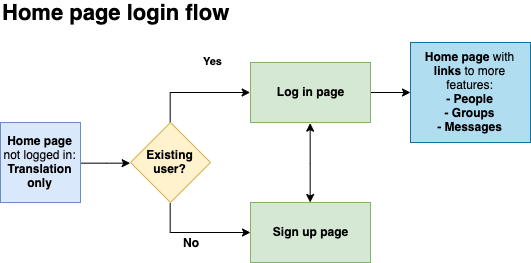
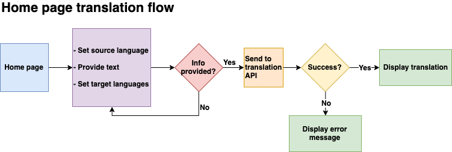
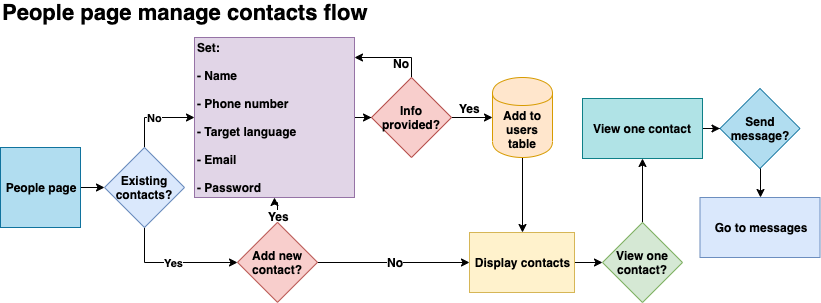
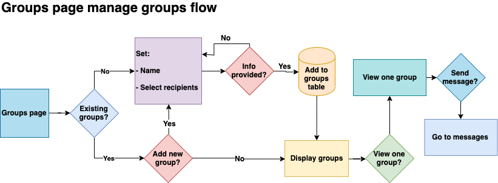
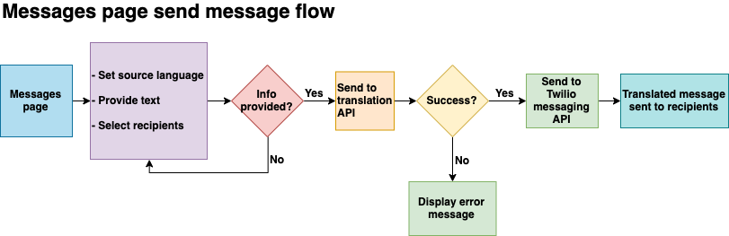
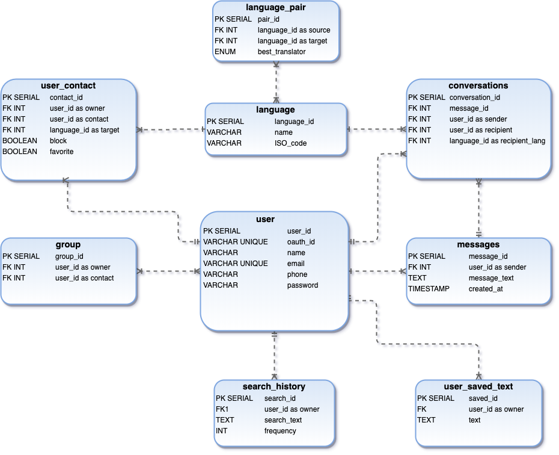

# **“Just Say In” app**

---

## What is Just Say In?

Just Say In is a translation and communication app that lets the user translate words and phrases into multiple languages at once, and also send out messages to one or more contacts. It will start off as a web app, and eventually will have a mobile app counterpart.

## One Sentence Pitch :

Just Say In is a multiple language translator and communication app, like Google Translate with SMS

# Features

## Milestone 1- MVP (minimum viable product)

1. Web app with multiple languages as target languages
2. Google/Facebook Login
3. Add contacts for messaging
4. Create a group
5. Message contacts
6. Ability to save used words/phrases

## Milestone 2- Text to speech

7. Text-to-speech functionality
8. Display frequently and recently used words/phrases
9. Images

## Milestone 3- Mobile app

The third milestone for Just Say In is a mobile app. A few additional features will also be included.

10. Mobile app
11. Choose word context
12. Choose regional variants
13. Learn frequent contexts

# User Flows

The home page will allow translation regardless of the user’s login status. Logging in will allow the user to manage contacts, groups, and messages.

## Data Models:

## Tech stack

*   HTML
*   CSS
*   JavaScript
*   React
*   Node
*   Express
*   Postgresql

### List of API’s to use :

*   Amazon Translate/ Google Translate/Amazon Polly Text to Speech/IBM Watson Speech to Text/Mozilla DeepSpeech APIs
*   AuthO login with Facebook and Google 
*   Twilio API (messaging)

## Things to Consider :

*   Data storage
*   Messaging storage

### Nice to have….

*   Ability to block words/images
*   Ability to select the context for single words (maybe by selecting from two or three synonyms?)
*   Ability to pull from other translation sources (Deepl/ Yandex/Microsoft?)and present alternate translations
    *   User marks “I don’t understand”
    *   App displays an alternate translation
*   Visual text recognition
    *   OCR functionality?
*   Speech to text
    *   ability to speak into the app and have the translation go out
    *   Ability to train the speech to text module to recognize an individual’s regional dialect and pronunciation pattern
*   Offline storage
*   Undoable delete